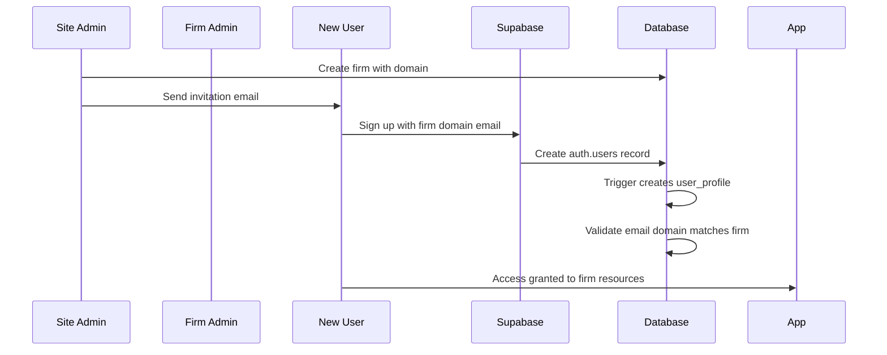
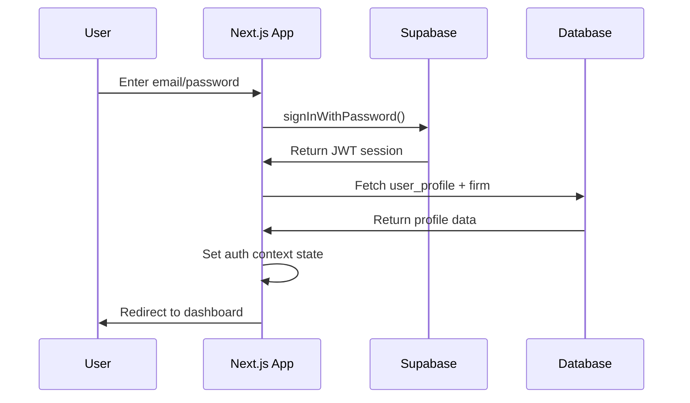
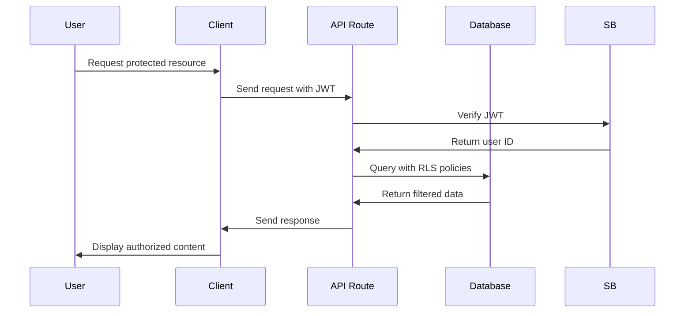

# Authentication & Authorization Architecture

## Overview

This document outlines the comprehensive authentication and authorization system for The Bradley Group's law firm portal. The system implements a hierarchical multi-tenant architecture with role-based access control (RBAC) and firm-based data isolation.

## System Architecture

### High-Level Design

```
┌─────────────────┐    ┌──────────────────┐    ┌─────────────────┐
│   Client App    │───▶│  Supabase Auth   │───▶│  Database RLS   │
│  (Next.js)      │    │   (JWT Tokens)   │    │   (Policies)    │
└─────────────────┘    └──────────────────┘    └─────────────────┘
         │                        │                       │
         ▼                        ▼                       ▼
┌─────────────────┐    ┌──────────────────┐    ┌─────────────────┐
│  Auth Context   │    │   User Profiles  │    │  Firm Isolation │
│  (React State)  │    │   (Custom Data)  │    │   (Row Level)   │
└─────────────────┘    └──────────────────┘    └─────────────────┘
```

### Core Components

1. **Supabase Authentication**: JWT-based session management
2. **User Profiles**: Extended user data with roles and firm associations
3. **Row Level Security**: Database-level access control
4. **Client-Side Context**: React state management for auth
5. **Server Actions**: Secure server-side operations

## User Hierarchy & Roles

### Role Structure

```
Site Admin (bradley@the-bradley-group.com)
├── Firm Admin A (admin@firmA.com)
│   ├── User A1 (user1@firmA.com)
│   └── User A2 (user2@firmA.com)
├── Firm Admin B (admin@firmB.com)
│   ├── User B1 (user1@firmB.com)
│   └── User B2 (user2@firmB.com)
└── Direct Clients (no firm affiliation)
```

### Role Definitions

| Role | Permissions | Access Level |
|------|-------------|--------------|
| `site_admin` | • Create/manage firms<br>• Access all data<br>• System administration | Global |
| `firm_admin` | • Manage firm users<br>• View firm analytics<br>• Firm configuration | Firm-scoped |
| `user` | • Submit forms<br>• View own submissions<br>• Save drafts | User-scoped |

## Data Model

### Core Tables

```sql
-- Supabase auth.users (built-in)
auth.users {
  id: uuid (primary)
  email: text
  encrypted_password: text
  email_confirmed_at: timestamptz
  ...
}

-- Custom user profiles
user_profiles {
  id: uuid (primary)
  user_id: uuid (references auth.users.id)
  firm_id: uuid (references firms.id, nullable)
  role: enum('site_admin', 'firm_admin', 'user')
  first_name: text
  last_name: text
  created_at: timestamptz
  updated_at: timestamptz
}

-- Law firms
firms {
  id: uuid (primary)
  name: text
  domain: text (unique)
  firm_admin_id: uuid (references auth.users.id)
  address_1: text
  city: text
  state: text
  zip_code: text
  main_phone: text
  image_url: text
  created_at: timestamptz
  updated_at: timestamptz
}

-- User invitations
user_invitations {
  id: uuid (primary)
  email: text
  firm_id: uuid (references firms.id)
  role: enum('firm_admin', 'user')
  invited_by: uuid (references auth.users.id)
  invited_at: timestamptz
  accepted_at: timestamptz (nullable)
}

-- Form submissions (example)
personal_injury_forms {
  id: uuid (primary)
  form_data: jsonb
  submitted_by: uuid (references auth.users.id)
  firm_id: uuid (references firms.id, nullable)
  status: enum('draft', 'submitted', 'under_review', 'completed')
  created_at: timestamptz
  updated_at: timestamptz
}
```

## Authentication Flow

### 1. User Registration/Invitation



### 2. Login Flow



### 3. Authorization Check



## Security Implementation

### Row Level Security (RLS) Policies

```sql
-- User profiles: Users can only see profiles in their firm
CREATE POLICY "user_profiles_select" ON user_profiles
FOR SELECT USING (
  auth.uid() = user_id OR
  (SELECT role FROM user_profiles WHERE user_id = auth.uid()) = 'site_admin' OR
  (SELECT firm_id FROM user_profiles WHERE user_id = auth.uid()) = firm_id
);

-- Forms: Users only see forms from their firm
CREATE POLICY "forms_select" ON personal_injury_forms
FOR SELECT USING (
  submitted_by = auth.uid() OR
  (SELECT role FROM user_profiles WHERE user_id = auth.uid()) = 'site_admin' OR
  (SELECT firm_id FROM user_profiles WHERE user_id = auth.uid()) = firm_id
);

-- Firms: Site admins see all, firm admins see their own
CREATE POLICY "firms_select" ON firms
FOR SELECT USING (
  (SELECT role FROM user_profiles WHERE user_id = auth.uid()) = 'site_admin' OR
  id = (SELECT firm_id FROM user_profiles WHERE user_id = auth.uid())
);
```

### Domain Validation

```typescript
export async function validateEmailDomain(email: string, firmId: string): Promise<boolean> {
  const emailDomain = email.split('@')[1]
  const { data: firm } = await supabase
    .from('firms')
    .select('domain')
    .eq('id', firmId)
    .single()
  
  return firm?.domain === emailDomain
}
```

## Client-Side Implementation

### Auth Context Architecture

```typescript
interface AuthContextType {
  // Core auth state
  user: User | null
  session: Session | null
  loading: boolean
  
  // Extended profile data
  userProfile: UserProfile | null
  userFirm: Firm | null
  
  // Role checks
  isSiteAdmin: boolean
  isFirmAdmin: boolean
  
  // Actions
  signIn: (email: string, password: string) => Promise<{error: AuthError | null}>
  signOut: () => Promise<void>
  resetPassword: (email: string) => Promise<{error: AuthError | null}>
  refreshProfile: () => Promise<void>
}
```

### Route Protection

```typescript
// HOC for protected routes
export function withAuth<P extends object>(
  Component: React.ComponentType<P>,
  requiredRole?: 'site_admin' | 'firm_admin'
) {
  return function AuthenticatedComponent(props: P) {
    const { user, userProfile, loading } = useAuth()
    
    if (loading) return <LoadingSpinner />
    if (!user) return <LoginForm />
    if (requiredRole && userProfile?.role !== requiredRole) {
      return <UnauthorizedMessage />
    }
    
    return <Component {...props} />
  }
}
```

## Current Implementation Status

### ✅ Completed Features

- [x] Supabase authentication integration
- [x] User profile system with roles
- [x] Firm-based data isolation
- [x] Domain validation for email addresses
- [x] Row Level Security policies
- [x] React auth context
- [x] Site admin dashboard
- [x] Form submission with firm association
- [x] Password reset flow

### ⚠️ Areas Needing Improvement

1. **Error Handling**: Auth context has scattered error handling
2. **Session Management**: No automatic session refresh
3. **Invitation System**: Email invitations not fully implemented
4. **Audit Logging**: No tracking of admin actions
5. **Permission Caching**: Profile fetched on every auth state change

### 🔄 Known Issues

1. **Profile Fetch Recursion**: Password reset triggers profile fetch loops
2. **RLS Performance**: Complex policies may impact query performance
3. **JWT Validation**: Client-side role checks not server-validated
4. **Session Persistence**: Auth state lost on browser refresh

## Implementation Tasks

### Phase 1: Core Security Hardening
- [ ] Implement server-side route protection middleware
- [ ] Add session refresh logic
- [ ] Improve error handling consistency
- [ ] Add audit logging for admin actions
- [ ] Performance optimization for RLS queries

### Phase 2: User Experience
- [ ] Complete email invitation system
- [ ] Add user onboarding flow
- [ ] Implement session timeout warnings
- [ ] Add profile management interface
- [ ] Multi-factor authentication support

### Phase 3: Advanced Features
- [ ] Single Sign-On (SSO) integration
- [ ] API key management for firms
- [ ] Advanced permission system
- [ ] User activity monitoring
- [ ] Automated security compliance reporting

## Security Considerations

### Best Practices Implemented
- ✅ JWT tokens for stateless authentication
- ✅ Row Level Security at database level
- ✅ Domain-based access control
- ✅ Secure password reset flow
- ✅ Client-side state management

### Security Gaps to Address
- ⚠️ No rate limiting on auth endpoints
- ⚠️ No audit trail for sensitive operations
- ⚠️ Client-side role checks need server validation
- ⚠️ No session invalidation on role change
- ⚠️ Missing security headers and CSRF protection

## Monitoring & Observability

### Required Metrics
- Authentication success/failure rates
- Session duration analytics
- Role-based access patterns
- Security violation attempts
- Performance metrics for auth operations

### Logging Requirements
- All admin operations
- Failed authentication attempts
- Permission violations
- Data access patterns
- System configuration changes

---

*This architecture document serves as the foundation for implementing secure, scalable authentication and authorization for The Bradley Group's multi-tenant law firm portal.*